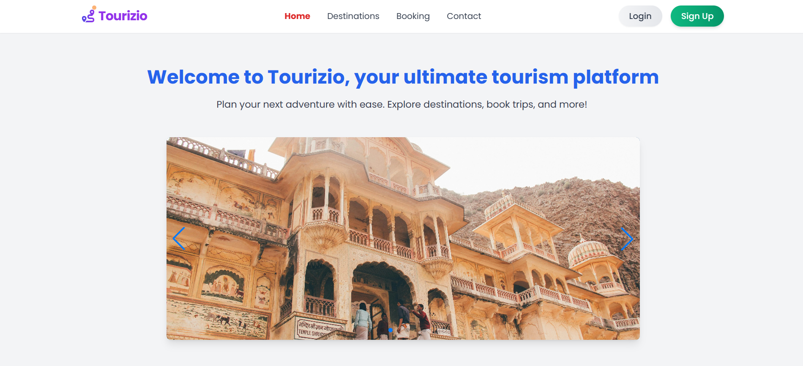
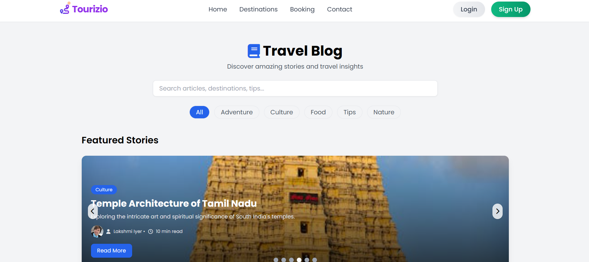
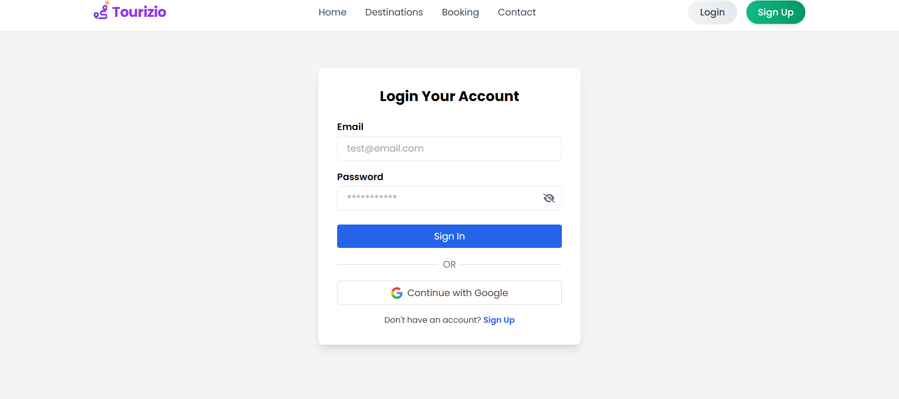
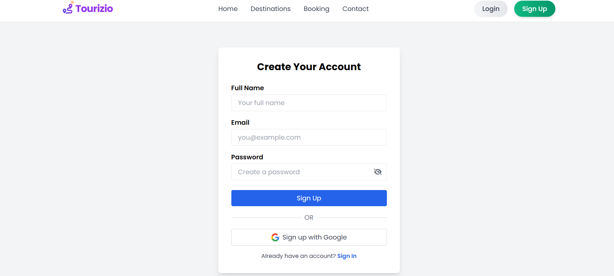

# 🌍 Tourizio – Tourism Platform

Tourizio is a modern **tourism information and booking platform** built with **Angular, TailwindCSS, Firebase, EmailJS, Web3Forms and Swiper.js**.  
It allows users to explore destinations, read travel blogs, book trips, and enjoy a smooth, responsive experience with animations.

🔗 **Live Demo:** https://tourizio-five.vercel.app/

---

## ✨ Features

- 🏝️ **Explore Destinations** – Featured attractions like Taj Mahal, Kerala Backwaters, Goa Beaches, and more.  
- 📖 **Travel Blog** – Dynamic blog section with images from **Pexels API**, categories, tags, likes, and skeleton loaders.  
- 🎠 **Carousels & Sliders** – Fully responsive image sliders powered by **Swiper.js**.  
- 🔐 **Authentication** – Firebase Auth with **Google Sign-In**, Email/Password login & signup.  
- ✉️ **Booking via EmailJS** – Booking requests sent using **EmailJS** (client-side) for quick booking emails.  
- 📨 **Contact via Web3Forms** – Contact form powered by **Web3Forms** (easy-to-configure form endpoint).  
- 🎨 **Modern UI** – Clean TailwindCSS design with gradient buttons, hover effects, and smooth transitions.  
- 📱 **Responsive Design** – Optimized for mobile, tablet, and desktop.  
- ⚡ **Performance Optimized** – Images converted to **WebP**, lazy loading enabled, scroll reveal animations.  
- ☁️ **Deployment** – Hosted on **Vercel**.
---

## 🛠️ Tech Stack

- **Frontend:** Angular, TypeScript, TailwindCSS  
- **UI / Controls:** Swiper.js, CSS animations  
- **Authentication & Hosting:** Firebase Auth (config in `environment.ts`)  
- **Booking Emails:** EmailJS (`@emailjs/browser`)  
- **Contact Form:** Web3Forms (API endpoint)  
- **Image sourcing (blog):** Pexels API  
- **Hosting / CI:** Vercel (project deployed)

---

## 📂 Project Structure

```
src/
├── app/
│   ├── components/   (navbar, footer, home, mini-map)
│   ├── pages/        (blog, login, profile, signup)
│   ├── services/     (auth, booking, user-sessions)
│   ├── app.module.ts
│   ├── app.component.ts
│   └── app-routing.module.ts
├── assets/
│   ├── data/         (JSON files: destinations.json, blogs.json etc.)
│   └── images/       (images)
├── environments/
│   ├── environment.ts
│   └── environment.prod.ts

```

---

## 🚀 Getting Started  

### 1️⃣ Clone the repo
```bash
git clone https://github.com/SayakBose1/tourizio.git
cd tourizio
```
### 2️⃣ Install dependencies
```bash
npm install
```
### 3️⃣ Set up environment variables
Create a environment.ts file and add your Firebase keys:
```bash
export const environment = {
  production: false,
  firebase: {
    apiKey: "YOUR_FIREBASE_KEY",
    authDomain: "your-app.firebaseapp.com",
    projectId: "your-app",
    storageBucket: "your-app.appspot.com",
    messagingSenderId: "xxxx",
    appId: "xxxx"
  },
};
```
### 4️⃣ Run the project
```bash
ng serve
```
Now open 👉 http://localhost:4200

---

## 🔑 Authentication

- **🔐 Email/Passwordd**
  - Signup & Login.
- **🔑 Google Sign-In**
  - Firebase OAuth.
- **🔄 Session Handling**
  - Redirect users after login / logout.

---

## 📸 Screenshots

### 🏠 Homepage


### 🏖️ Destinations


### 📰 Blog


### 🔐 Auth (Login / Signup)



---

## Deployment

### 🚀 Vercel
Auto-deployment via GitHub integration.

Manually:
```bash
vercel --prod
```

---

## 🤝 Contributing

Contributions, issues, and feature requests are welcome!
Feel free to fork the repo, open a PR, or raise an issue.

---

## 📜 License

This project is licensed under the MIT License.
You are free to use, modify, and distribute it.

---
